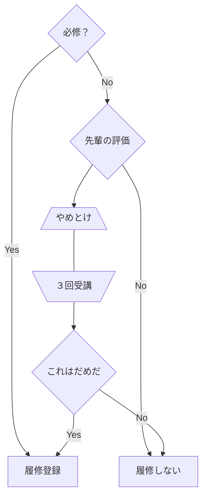

# 課題

```mermaid
flowchart TD
hisshu{"必修？"}
senpai{"先輩の評価"}
loop[/"やめとけ"\]
loopend[\"３回受講"/]
dameda{"これはだめだ"}

rishu["履修登録"]
pass["履修しない"]

hisshu -->|Yes| rishu
hisshu -->|No| senpai
senpai -->|No| pass
senpai --> loop
loop --- loopend
loopend --> dameda
dameda --> |No| pass
dameda  --> |Yes| rishu

```
